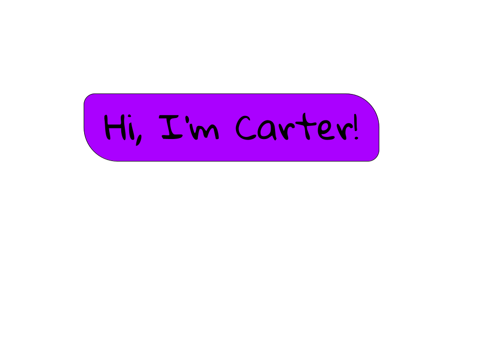

---

## Quick Facts

  * I am attending Michigan Technological University
  * I am majoring in Electrical and Computer Engineering
  * My favorite language is C
  * My least favorite language is Java
  * I love to read about space
  * I love watching football (GEAUX SAINTS!)
  * My main computer is a Lenovo Thinkpad X230 (The best laptop in the world)
    * Distro:   Ubuntu 20.04
    * CPU:      Intel i5-3320 Quad Core @ 3.30GHz
    * RAM:      16GB DDR3L @ 1600MHz
---

### Social Media
&nbsp;
&nbsp;
&nbsp;

### Languages
&nbsp;
&nbsp;
&nbsp;

&nbsp;

